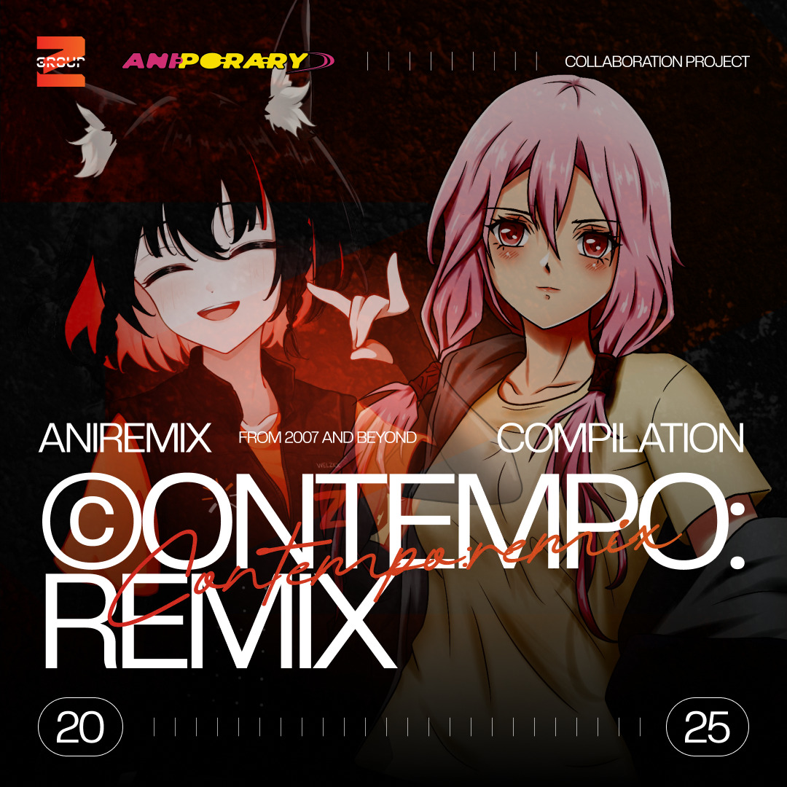

CROSSFADE: [CONTEMPO:REMIX [XFD]](https://soundcloud.com/z-miscellanea/contemporemix-xfd)

DOWNLOAD: [CONTEMPO:REMIX](https://groupzcollective.bandcamp.com/album/contempo-remix)

## THE ANIME OF OUR TIMES

I participated in the CONTEMPO:REMIX compilation, showcasing remixes of anisongs from a certain contemporary era. For my part, I chose to do something with an anisong that has quite a place in my personal history: Stardust Interlude (Hoshikuzu no Interlude) by fhana.

Like many others in such a contemporary era, my first exposure to Japanese pop culture is this rhythm game that has evolved quite a bit, but it's name stayed the same: [osu!](https://osu.ppy.sh). Stardust Interlude was one of the first beatmaps I tried out in that game.

Since then, I have drifted off from osu! entirely, and my listening habits have quite changed significantly. Given the opportunity, I revisited this particular era again, lending the Astral Experiments spirit to an old tale.

---

A collaboration project between Aniporary (@aniporary) & Group Z Collective (@group.z.collective). Showcasing the best of contemporary Anisong from 2007 and beyond, packed with full flavour to dazzle your eardrums.

Featuring Artist (Alphabetical) :
* Asobi Station
* BHM
* Damillora
* dan3ta
* fortiMiND
* gectheory
* HiRamaki
* morethanahalf
* Ossan Aidoru
* Rukadesu
* vocabot-P
* Voltexia

Mastering by fortiMiND

Design by Sugoism
